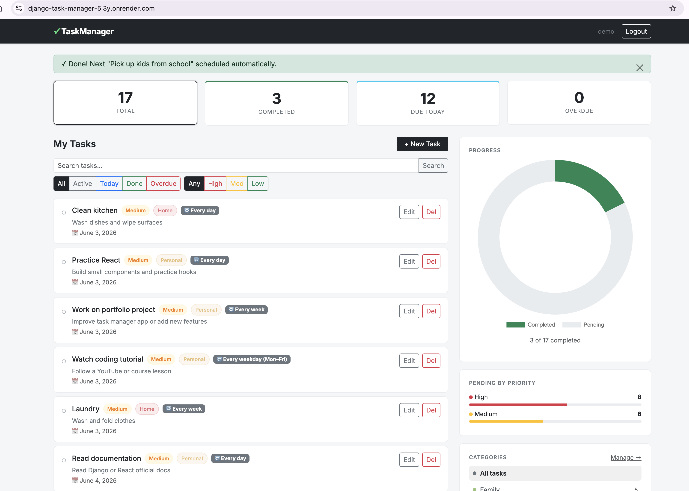

# Django Task Manager

A full-stack task management web app built with Python and Django.

**Live demo:** *(https://django-task-manager-5l3y.onrender.com/)*



## Features

- User registration and login
- Create, edit, and delete tasks
- Mark tasks complete / incomplete
- Set priority (Low / Medium / High) and due dates
- Filter tasks by status (All / Active / Completed)
- Progress bar showing completion percentage
- Admin panel for managing all data

## Tech Stack

- **Backend:** Python 3, Django 4.2
- **Database:** SQLite (development) / PostgreSQL (production)
- **Frontend:** Django Templates, Bootstrap 5
- **Auth:** Django built-in authentication

## Getting Started

### 1. Clone the repo
```bash
git clone https://github.com/FatemaAlhosein/django-task-manager.git
cd django-task-manager
```

### 2. Create a virtual environment
```bash
python -m venv venv
source venv/bin/activate        # Mac/Linux
venv\Scripts\activate           # Windows
```

### 3. Install dependencies
```bash
pip install -r requirements.txt
```

### 4. Run migrations
```bash
python manage.py migrate
```

### 5. Create a superuser (optional, for admin panel)
```bash
python manage.py createsuperuser
```

### 6. Start the server
```bash
python manage.py runserver
```

Visit **http://127.0.0.1:8000** in your browser.

## Project Structure

```
django-task-manager/
├── taskmanager/        # Project config (settings, urls)
├── tasks/              # Main app
│   ├── models.py       # Task model
│   ├── views.py        # CRUD views
│   ├── forms.py        # Task + registration forms
│   ├── urls.py         # URL routing
│   └── templates/      # HTML templates
└── requirements.txt
```

## Author

**Fatema Alhosein** — [github.com/FatemaAlhosein](https://github.com/FatemaAlhosein) · [LinkedIn](https://linkedin.com/in/fatemaalhosein)
